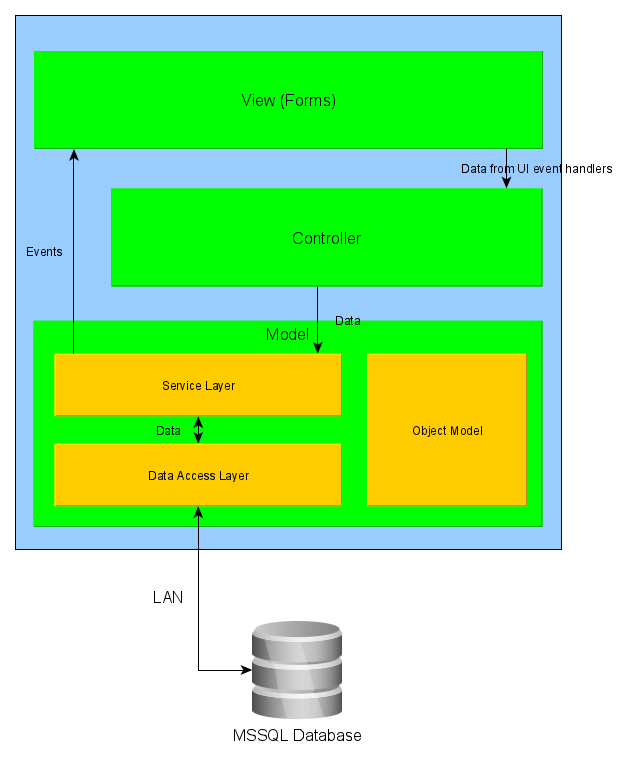

# Retail POS
A toy application for a Retail Point of Sale (POS) system. It is not for professional use!!! Targets the .NET Framework version 4.6.1 using WinForms. It uses a client-server architecture and can be used on a local network.

The server component is a Microsoft SQL Server database. A database is created on a server computer. SQL scripts to generate the table structure are included.

The client component is a WinForms application. The source code as a Microsoft Visual Studio solution is the main content of this repository.

**Current version: v0.1.1**

## Installation and Setup
### Client
No installation process is required. The `POS\bin\Release` directory contains the binary for the application, and can placed anywhere on disk.

Once the database has been set up (according to the next section), the client must be configured. In the binary directory, the `POS.exe.config` file has the following parameters that must be set:

- Server address. This is the IP address of the computer on which the database resides. 
- Server user. User account in SQL Server.
- Server password. Password for the above account.
- Store name. Can be set to anything.

### Server
Uses a SQL Server 2017 database. Create a new database, then run the script `sqlScripts\createTables.sql` to create the table structure. The database can be filled with sample data using the script `sqlScripts\fillTables.sql`. The `sqlScripts\misc` directory contains some miscellaneous scripts.

## Architecture

## Usage
Use cases are provided in the `docs` directory. User manual to be part of a future release.

## Attributions
Icons by Icons8:
http://www.icons8.com

## Contributing
Please ask.

## License
None